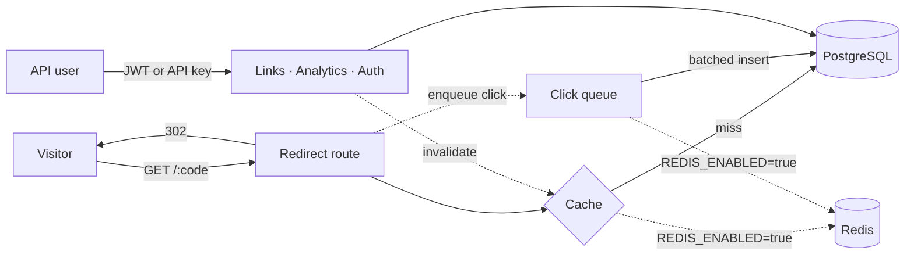

# URL Shortener API

[](https://github.com/ebrahimmorkas/url-shortener-api/actions/workflows/ci.yml)


A URL shortener with click analytics, in the style of Bitly: short links with custom aliases,
expiry dates, click caps and QR codes, a redirect path that stays fast under load, and
per-link statistics. Built with Node.js, TypeScript, Fastify and PostgreSQL.

## Highlights

| Problem                                    | Solution                                                                                                                                                             |
| ------------------------------------------ | -------------------------------------------------------------------------------------------------------------------------------------------------------------------- |
| Redirects must be fast                     | Short codes are resolved from a cache (Redis, or an in-memory LRU). Editing or disabling a link invalidates its cache entry.                                         |
| Recording a click must not slow a redirect | The redirect only enqueues the click in memory. A buffer flushes in batches (through BullMQ when Redis is enabled) and is drained on shutdown so no clicks are lost. |
| Counting unique visitors without tracking  | A salted, daily-rotating hash of IP and user agent. No raw IP addresses are stored.                                                                                  |
| Charts need continuous data                | Time series are gap-filled in SQL with `generate_series`, in UTC, so empty hours or days come back as zero.                                                          |
| Scripts need access without a login        | API keys (`X-API-Key`), stored hashed and shown once, alongside JWT for interactive use.                                                                             |
| Abuse and brute force                      | Rate limits per API key or IP, stricter on login/registration, counted before authentication so bad credentials are throttled too.                                   |
| Docs drifting from code                    | OpenAPI is generated from the same Zod schemas that validate requests and responses. Swagger UI is at `/docs`.                                                       |
| Needs Redis to run?                        | **No.** Every Redis-backed feature has an in-process fallback (see below).                                                                                           |

## Tech stack

- **Runtime:** Node.js 20+, TypeScript (strict, ESM), Fastify 5 with the Zod type provider
- **Database:** PostgreSQL with Drizzle ORM and SQL migrations
- **Optional infrastructure:** Redis (ioredis) for the redirect cache and rate limits, BullMQ for
  click ingestion
- **Security:** JWT, hashed API keys, bcrypt, Helmet, CORS, rate limiting, Zod validation
- **Docs:** OpenAPI 3 + Swagger UI generated from route schemas
- **Testing:** Vitest integration tests against a real PostgreSQL database
- **DevOps:** Docker multi-stage build, docker compose, GitHub Actions CI (with and without Redis)

## Architecture



### Running with or without Redis

| Feature         | `REDIS_ENABLED=true`                  | `REDIS_ENABLED=false` (default)  |
| --------------- | ------------------------------------- | -------------------------------- |
| Redirect cache  | Redis, shared by all instances        | In-memory LRU                    |
| Rate limiting   | Redis counters, consistent everywhere | Per-process counters             |
| Click ingestion | BullMQ queue                          | In-process buffer, batched flush |

CI runs the full test suite in **both** modes.

## Getting started

### Docker

```bash
docker compose up --build                                    # API + PostgreSQL
REDIS_ENABLED=true docker compose --profile redis up --build  # + Redis
```

The API is at http://localhost:3002 and the interactive docs at http://localhost:3002/docs.

### Local Node.js

Requirements: Node.js 20+, PostgreSQL 14+ (Redis optional).

```bash
git clone https://github.com/ebrahimmorkas/url-shortener-api.git
cd url-shortener-api
cp .env.example .env          # adjust DATABASE_URL if needed
npm install
npm run dev                   # migrations run on startup; http://localhost:3002
```

### Try it

```bash
# 1. Create an account and keep the token
TOKEN=$(curl -s localhost:3002/api/v1/auth/register -H 'Content-Type: application/json' \
  -d '{"email":"me@example.com","name":"Me","password":"Password123"}' | jq -r .token)

# 2. Shorten a URL (alias, expiry and click cap are optional)
curl -s localhost:3002/api/v1/links -H "Authorization: Bearer $TOKEN" \
  -H 'Content-Type: application/json' \
  -d '{"targetUrl":"https://nodejs.org/en/docs","alias":"node-docs"}' | jq .link.shortUrl

# 3. Follow it
curl -si localhost:3002/node-docs | head -3

# 4. See the clicks
curl -s "localhost:3002/api/v1/links/<link-id>/stats?interval=hour" \
  -H "Authorization: Bearer $TOKEN" | jq '{totals, referrers}'
```

## API overview

Full reference: **`/docs`** (Swagger UI) or `/docs/json` (OpenAPI).

| Method | Endpoint                     | Access | Description                                                    |
| ------ | ---------------------------- | ------ | -------------------------------------------------------------- |
| POST   | `/api/v1/auth/register`      | Public | Create an account                                              |
| POST   | `/api/v1/auth/login`         | Public | Log in and receive a JWT                                       |
| GET    | `/api/v1/auth/me`            | User   | Current user                                                   |
| POST   | `/api/v1/api-keys`           | User   | Create an API key (the secret is shown only once)              |
| GET    | `/api/v1/api-keys`           | User   | List API keys                                                  |
| DELETE | `/api/v1/api-keys/:id`       | User   | Revoke an API key                                              |
| POST   | `/api/v1/links`              | User   | Shorten a URL (optional alias, expiry, click cap)              |
| GET    | `/api/v1/links`              | User   | My links, newest first, cursor-paginated                       |
| GET    | `/api/v1/links/:id`          | Owner  | One link                                                       |
| PATCH  | `/api/v1/links/:id`          | Owner  | Change destination, title or limits; disable                   |
| DELETE | `/api/v1/links/:id`          | Owner  | Delete a link                                                  |
| GET    | `/api/v1/links/:id/qr`       | Owner  | QR code (PNG) for the short URL                                |
| GET    | `/api/v1/links/:id/stats`    | Owner  | Totals, unique visitors, time series and breakdowns            |
| GET    | `/api/v1/analytics/overview` | User   | Account totals and most-clicked links                          |
| GET    | `/:code`                     | Public | Redirect (`302`), `404` unknown, `410` disabled/expired/capped |
| GET    | `/health`                    | Public | Liveness and dependency status                                 |

"User" endpoints accept `Authorization: Bearer <jwt>` or `X-API-Key: <key>`.

Errors share one shape:

```json
{ "error": { "code": "RATE_LIMITED", "message": "Rate limit exceeded, retry in 1 minute" } }
```

## Configuration

| Variable                     | Default                  | Description                                            |
| ---------------------------- | ------------------------ | ------------------------------------------------------ |
| `PORT`                       | `3002`                   | HTTP port                                              |
| `BASE_URL`                   | `http://localhost:3002`  | Public origin used to build short links                |
| `DATABASE_URL`               | —                        | PostgreSQL connection string (**required**)            |
| `MIGRATE_ON_START`           | `true`                   | Apply pending SQL migrations on startup                |
| `JWT_SECRET`                 | —                        | ≥ 32 characters (**required**)                         |
| `REDIS_ENABLED`              | `false`                  | Redis cache, distributed rate limits and BullMQ clicks |
| `REDIS_URL`                  | `redis://localhost:6379` | Redis connection                                       |
| `REDIRECT_CACHE_TTL_SECONDS` | `300`                    | How long a resolved short code is cached               |
| `CLICK_FLUSH_INTERVAL_MS`    | `1000`                   | How often buffered clicks are written                  |
| `CLICK_BATCH_SIZE`           | `500`                    | Flush early when this many clicks are waiting          |
| `RATE_LIMIT_MAX`             | `120`                    | Requests per minute per caller (API key, otherwise IP) |
| `AUTH_RATE_LIMIT_MAX`        | `10`                     | Login/registration requests per minute                 |
| `REDIRECT_RATE_LIMIT_MAX`    | `600`                    | Redirects per minute per IP                            |
| `CORS_ORIGIN`                | `*`                      | Comma-separated allowed origins                        |
| `LOG_LEVEL`                  | `info`                   | pino log level                                         |

The environment is validated at startup; the process exits with a clear message if anything is
missing.

## Testing

```bash
npm test          # integration tests (needs PostgreSQL)
npm run lint
npm run typecheck
```

Tests run against a real database (`shortener_test` by default, override with
`TEST_DATABASE_URL`). The database is created and migrated automatically before the suite. They
cover authentication and API keys, link rules, redirects and caching, click ingestion,
analytics, rate limiting and the generated OpenAPI document.

## Project structure

```
src/
├── app.ts                 # Fastify app factory
├── server.ts              # Bootstrap, migrations, graceful shutdown
├── config/env.ts          # Zod-validated environment
├── db/                    # Drizzle schema, client, migration runner
├── plugins/               # error handler, rate limiting, OpenAPI docs
├── modules/
│   ├── auth/              # accounts, JWT, API keys
│   ├── links/             # short codes, aliases, expiry, click caps, QR
│   ├── redirects/         # cached redirect, click queue and batch writer
│   └── analytics/         # per-link stats and account overview
└── routes/health.ts
drizzle/                   # SQL migrations
test/                      # Vitest integration suites
```

## Possible extensions

- Custom domains per account
- Geo lookup for the country breakdown from a local IP database
- Scheduled rollups of old click rows into daily aggregates
- Link-in-bio pages and UTM builders

## License

[MIT](LICENSE)
